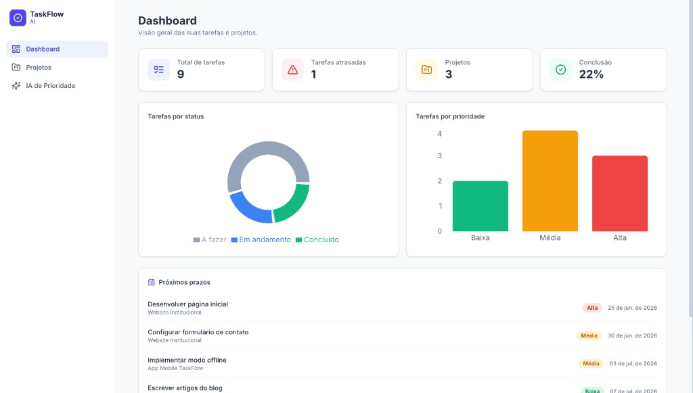
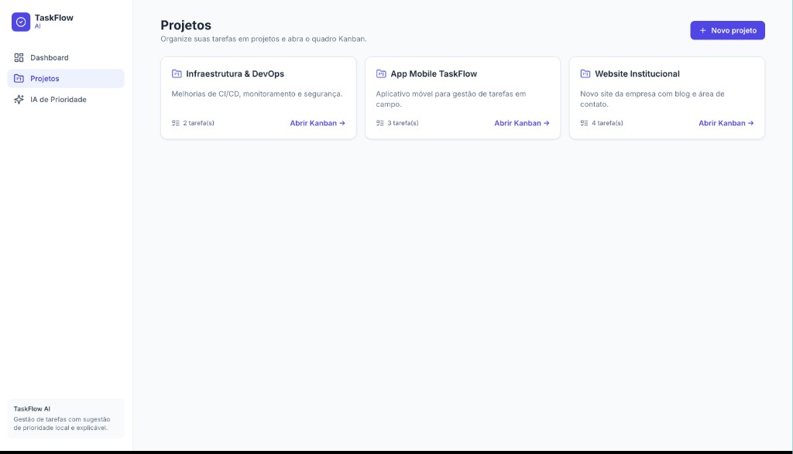
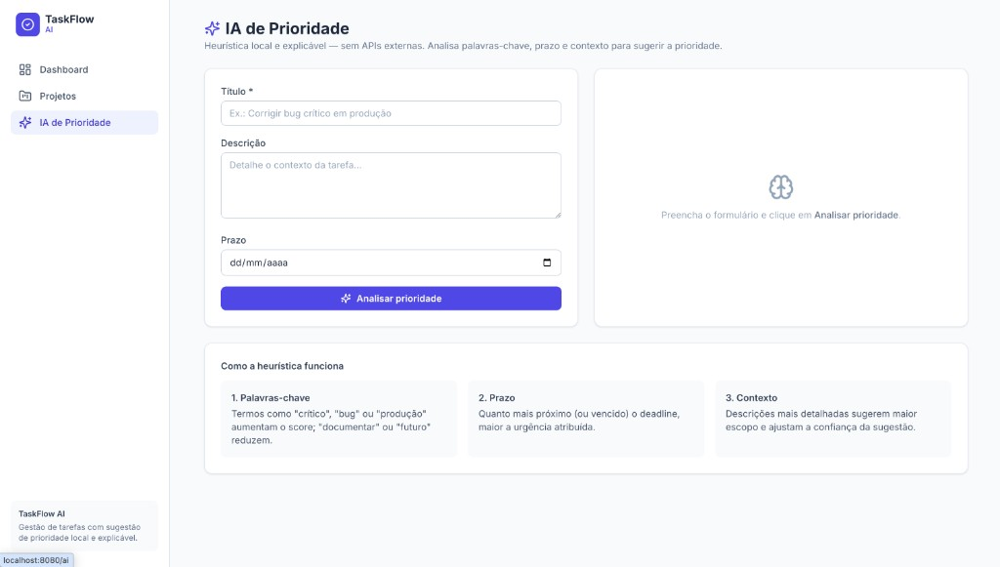

# TaskFlow AI

Gerenciador de tarefas moderno **fullstack** com backend em **NestJS** e frontend em **React + Vite**, incluindo um **quadro Kanban por projeto**, **dashboard com métricas** e uma **sugestão de prioridade por "IA" local e explicável** (sem dependência de APIs externas).

Projeto pensado como peça de portfólio: código limpo, modular, validado, documentado via Swagger e pronto para subir com **Docker Compose**.

---

## 📸 Preview

Interface moderna, responsiva e pronta para portfólio — veja como o app se comporta **sem precisar clonar ou rodar localmente**:

### Dashboard

Visão geral com métricas, gráficos por status/prioridade e próximos prazos.



### Projetos

Gerenciamento de projetos com contagem de tarefas e acesso direto ao quadro Kanban.



### IA de Prioridade

Playground interativo que analisa título, descrição e prazo para sugerir prioridade com score e motivos explicáveis.



---

## ✨ Funcionalidades

- **Projetos** — CRUD completo (nome + descrição).
- **Tarefas** — CRUD completo com `título`, `descrição`, `status` (TODO / DOING / DONE), `prioridade` (LOW / MEDIUM / HIGH), `deadline` e `projectId`.
- **Kanban por projeto** — três colunas com **drag-and-drop** e atualização otimista.
- **Dashboard** — total de tarefas, tarefas atrasadas, conclusão (%), distribuição por status e por prioridade (gráficos) e próximos prazos.
- **IA de Prioridade (local)** — endpoint que sugere a prioridade a partir do título, descrição e prazo, retornando **score, confiança e os motivos** da decisão. Lógica 100% explicável, sem chamadas externas.
- **Frontend moderno e responsivo** — React + TailwindCSS, layout com sidebar, modais e gráficos.
- **Swagger** — documentação interativa da API.

---

## 🧱 Stack

| Camada    | Tecnologias                                                        |
| --------- | ----------------------------------------------------------------- |
| Backend   | NestJS, TypeScript, Prisma ORM, PostgreSQL, class-validator, Swagger |
| Frontend  | React, TypeScript, Vite, TailwindCSS, React Router, Axios, Recharts |
| Infra     | Docker, Docker Compose, Nginx (serve o build do frontend)         |

---

## 📂 Estrutura do projeto

```
.
├── docker-compose.yml          # Orquestra postgres + backend + frontend
├── .env.example                # Variáveis usadas pelo docker-compose
├── docs/
│   └── screenshots/            # Capturas de tela para o README
├── backend/
│   ├── Dockerfile
│   ├── prisma/
│   │   ├── schema.prisma       # Modelos Project e Task + enums
│   │   └── seed.ts             # Dados iniciais
│   └── src/
│       ├── main.ts             # Bootstrap, CORS, ValidationPipe, Swagger
│       ├── app.module.ts
│       ├── common/filters/     # Filtro global de exceções
│       ├── prisma/             # PrismaModule + PrismaService (global)
│       ├── projects/           # CRUD de projetos
│       ├── tasks/              # CRUD de tarefas + IA de prioridade
│       │   └── ai/priority-suggester.ts
│       └── dashboard/          # Métricas agregadas
└── frontend/
    ├── Dockerfile
    ├── nginx.conf
    └── src/
        ├── api/                # Cliente Axios + serviços
        ├── components/         # Layout, Modal, TaskForm, etc.
        ├── pages/              # Dashboard, Projetos, Kanban, IA
        ├── lib/                # Helpers de formatação
        └── types/              # Tipos compartilhados
```

---

## 🚀 Rodando com Docker (recomendado)

Pré-requisitos: **Docker** e **Docker Compose**.

```bash
# 1. Clone o repositório e entre na pasta
cd Taskflow-AI

# 2. Crie o .env a partir do exemplo
cp .env.example .env

# 3. Suba tudo (postgres + backend + frontend)
docker compose up --build
```

O backend automaticamente aplica as **migrations**, executa o **seed** e sobe a API.

| Serviço      | URL                              |
| ------------ | -------------------------------- |
| Frontend     | http://localhost:8080            |
| API (NestJS) | http://localhost:3000/api        |
| Swagger      | http://localhost:3000/docs       |
| PostgreSQL   | localhost:5432                   |

Para parar: `docker compose down` (use `docker compose down -v` para apagar também o volume do banco).

> **Variáveis** (`.env`): `POSTGRES_USER`, `POSTGRES_PASSWORD`, `POSTGRES_DB`, `BACKEND_PORT`, `FRONTEND_PORT`, `VITE_API_URL`. Veja `.env.example`.

---

## 🛠️ Rodando localmente (sem Docker)

### Pré-requisitos

- Node.js 20+
- Uma instância de PostgreSQL acessível

### Backend

```bash
cd backend
cp .env.example .env          # ajuste DATABASE_URL se necessário
npm install
npm run prisma:generate
npm run prisma:migrate        # cria as tabelas
npm run prisma:seed           # popula dados de exemplo
npm run start:dev             # http://localhost:3000/api
```

### Frontend

```bash
cd frontend
cp .env.example .env          # VITE_API_URL=http://localhost:3000
npm install
npm run dev                   # http://localhost:5173
```

---

## 🤖 Como funciona a "IA" de prioridade

A sugestão é uma **heurística determinística e explicável** (arquivo `backend/src/tasks/ai/priority-suggester.ts`). Ela combina três sinais em um score de 0 a 100:

1. **Palavras-chave** — termos de alta urgência (`crítico`, `bug`, `produção`, `segurança`…) aumentam o score; termos de baixa urgência (`documentar`, `futuro`, `backlog`…) reduzem.
2. **Prazo (deadline)** — quanto mais próximo (ou vencido) o prazo, maior a urgência atribuída.
3. **Contexto** — descrições mais detalhadas indicam maior escopo e aumentam a confiança.

Faixas finais:

| Score    | Prioridade |
| -------- | ---------- |
| ≥ 65     | **HIGH**   |
| 35 – 64  | **MEDIUM** |
| < 35     | **LOW**    |

A resposta inclui `score`, `confidence` e uma lista de `reasons`, deixando a decisão totalmente transparente.

**Exemplo:**

```bash
curl -X POST http://localhost:3000/api/tasks/suggest-priority \
  -H "Content-Type: application/json" \
  -d '{
    "title": "Corrigir bug crítico de login em produção",
    "description": "Usuários não conseguem autenticar.",
    "deadline": "2026-06-25T23:59:00.000Z"
  }'
```

---

## 📡 Principais endpoints da API

Prefixo global: `/api`

| Método | Rota                          | Descrição                                  |
| ------ | ----------------------------- | ------------------------------------------ |
| GET    | `/projects`                   | Lista projetos (com contagem de tarefas)   |
| POST   | `/projects`                   | Cria projeto                               |
| GET    | `/projects/:id`               | Detalha projeto com tarefas                |
| PATCH  | `/projects/:id`               | Atualiza projeto                           |
| DELETE | `/projects/:id`               | Remove projeto (e suas tarefas)            |
| GET    | `/tasks`                      | Lista tarefas (filtros: projectId, status, priority) |
| POST   | `/tasks`                      | Cria tarefa                                |
| PATCH  | `/tasks/:id`                  | Atualiza tarefa                            |
| DELETE | `/tasks/:id`                  | Remove tarefa                              |
| POST   | `/tasks/suggest-priority`     | Sugere prioridade (IA local)               |
| GET    | `/dashboard/stats`            | Métricas agregadas (filtro: projectId)     |
| GET    | `/health`                     | Health check                               |

Documentação interativa completa em **`/docs`** (Swagger).

---

## 🧹 Qualidade e organização

- **NestJS modular**: módulos independentes para `projects`, `tasks` e `dashboard`.
- **DTOs validados** com `class-validator` + `ValidationPipe` global (whitelist + transform).
- **Tratamento global de erros** com formato de resposta padronizado e mapeamento de erros do Prisma.
- **Prisma schema** bem definido com enums, relações e índices.
- **Seed** idempotente com dados realistas.
- **Swagger** configurado e tagueado por domínio.

---

